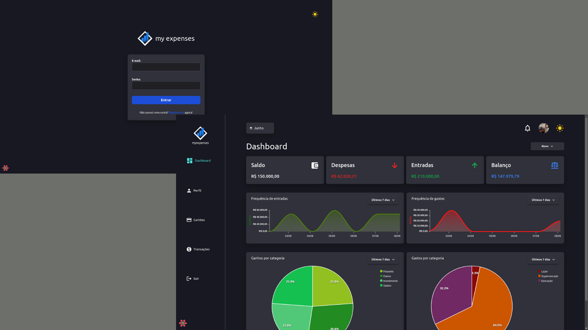
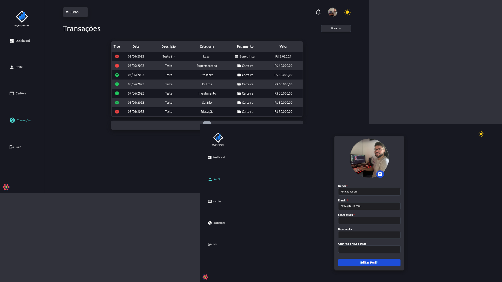
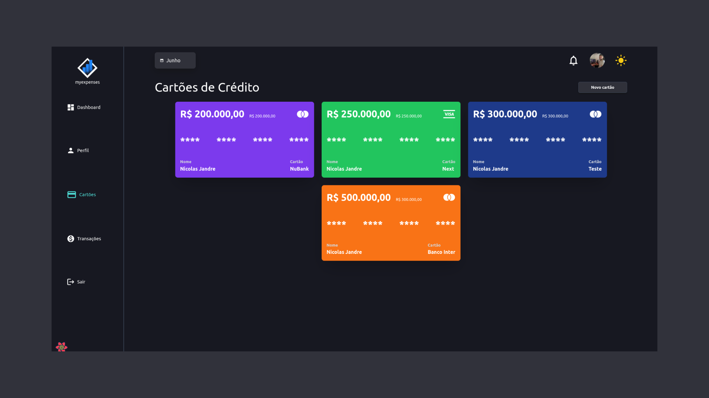
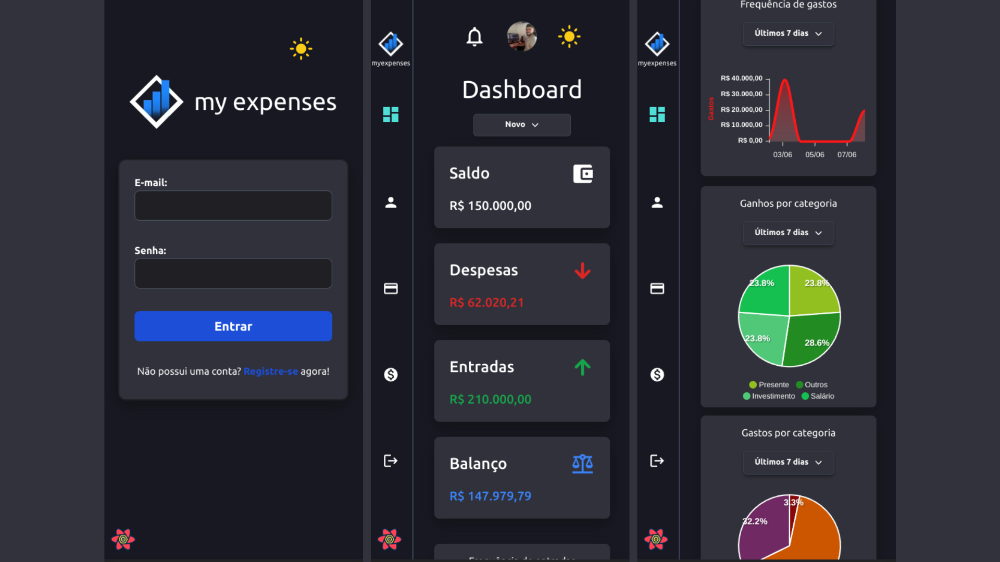
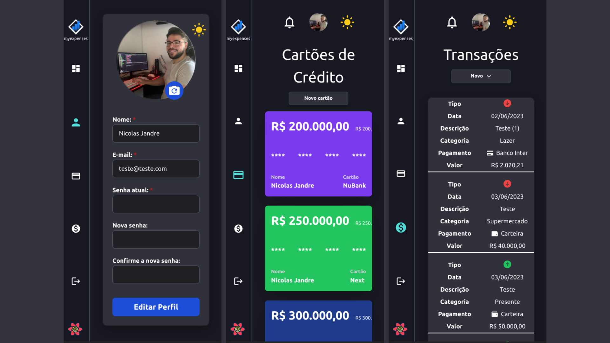

<h1 align="center">my expenses.</h1>

Personal expenses backend project made in Java and Spring Boot 3.0.5. It has complete documentation with Swagger and JWT + refresh token.

<h2 align="center">Design</h2>

Tecnologies:
 Next.js
 Typescript
 TailwindCSS
 Nookies
 React Hook Form
 Axios
 React Datepicker
 Apex Charts
 React Query

